# Desafio 10: Seguridad IT

## Dominio "vulnweb.com"
Utilizar dig para obtener información de DNS
Abre tu terminal y ejecuta los siguientes comandos:

- Comando dig:

    ```shell
    $ dig vulnweb.com
    ```
    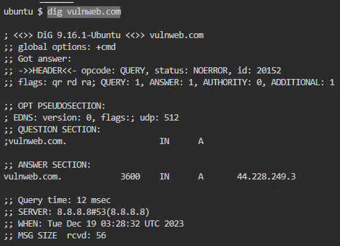

- Comando whois:

    ```shell
    $ whois vulnweb.com
    ```

    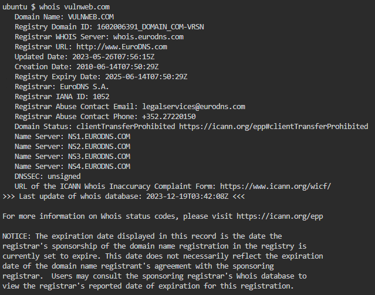

    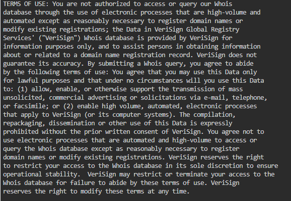

    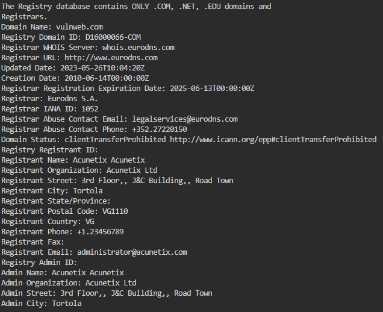

    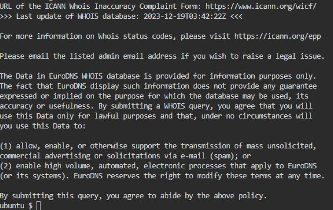


### "vulnweb.com" en Google
Información adicional sobre el dominio "vulnweb.com" en Google. Ingresa "vulnweb.com" en el motor de búsqueda y revisa los resultados.

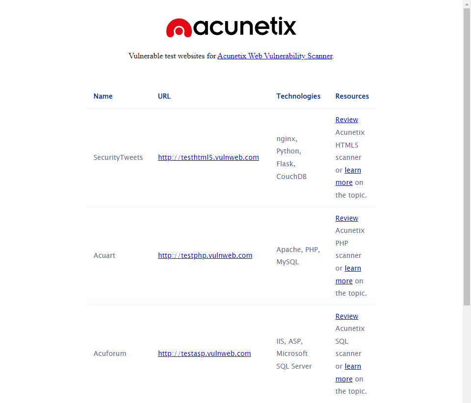

### Sitios Web Hosteados
Utiliza herramientas en línea para identificar qué sitios web están hosteados en "vulnweb.com". La seleccionada para este laboratorio fue Sublist3r.
- Windows:

    ```shell
    $ choco install python
    $ python -m pip install -U pip
    $ git clone https://github.com/aboul3la/Sublist3r.git
    $ C:\Python312\python.exe -m pip install -r requirements.txt
    $ C:\Python312\python.exe -m pip install requests
    $ C:\Python312\python.exe -m pip install dnspython
    $ C:\Python312\python.exe -m pip install win_unicode_console colorama
    $ python sublist3r.py -d vulnweb.com
    ```

    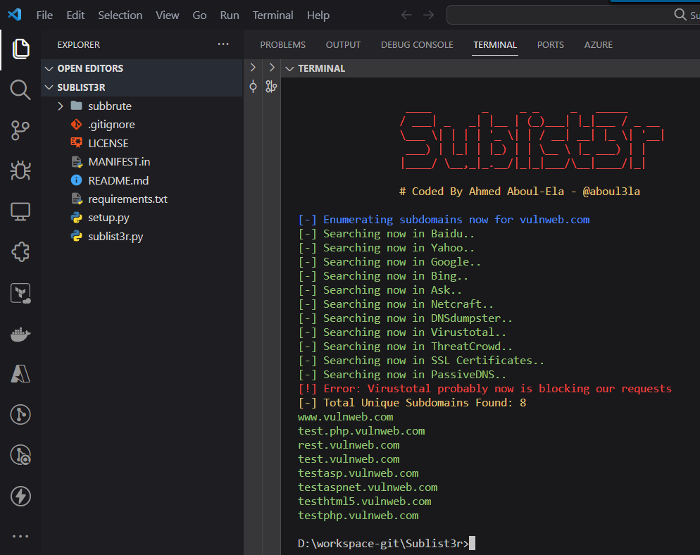

    Esta herramienta te proporcionarán una lista de subdominios asociados con "vulnweb.com".

## Sitios Web y Geolocalización

### Utilizar dig para obtener las direcciones IP
### Identificar la dirección IP de cada sitio
Comando para obtener las direcciones IP de los sitios web específicos
- Windows:

    ```shell
    $ dig +short www.vulnweb.com (44.228.249.3)
    $ dig +short test.php.vulnweb.com (44.228.249.3)
    $ dig +short rest.vulnweb.com (35.81.188.86)
    $ dig +short test.vulnweb.com (44.228.249.3)
    $ dig +short testasp.vulnweb.com (44.238.29.244)
    $ dig +short testaspnet.vulnweb.com (44.238.29.244)
    $ dig +short testhtml5.vulnweb.com (44.228.249.3)
    $ dig +short testphp.vulnweb.com (44.228.249.3)
    ```

    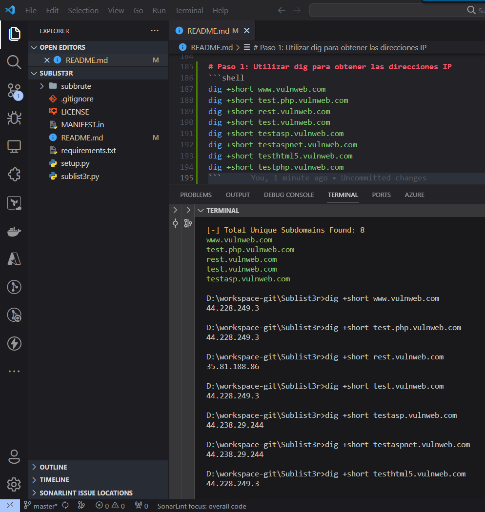

### Herramienta geoip
Geoiplookup sirve para identificar la geolocalización de cada dirección IP
- Linux:

    ```shell
    $ sudo apt-get install geoip-bin
    $ geoiplookup 44.228.249.3
    $ geoiplookup 35.81.188.86
    $ geoiplookup 44.238.29.244
    ```

    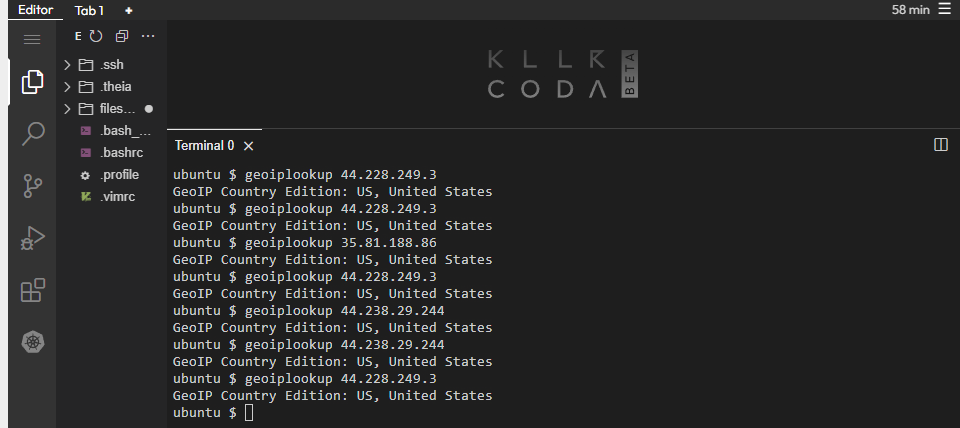

### Nmap para obtener información adicional
Nmap sirve para obtener información adicional, como puertos abiertos, de cada dirección IP
- Linux:

    ```shell
    $ sudo apt-get install nmap
    $ nmap -Pn 44.228.249.3
    $ nmap -Pn 35.81.188.86
    $ nmap -Pn 44.238.29.244
    ```

    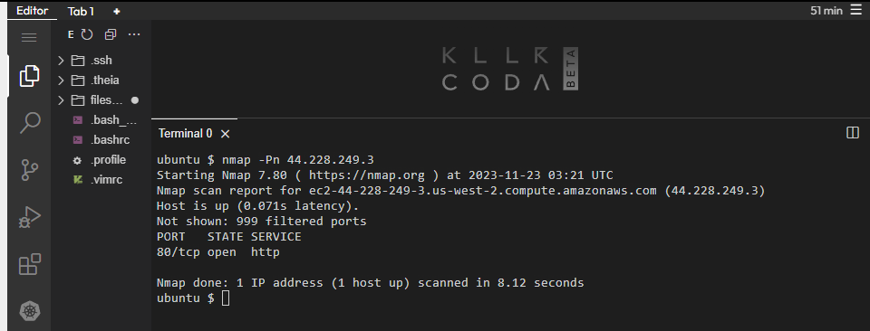

    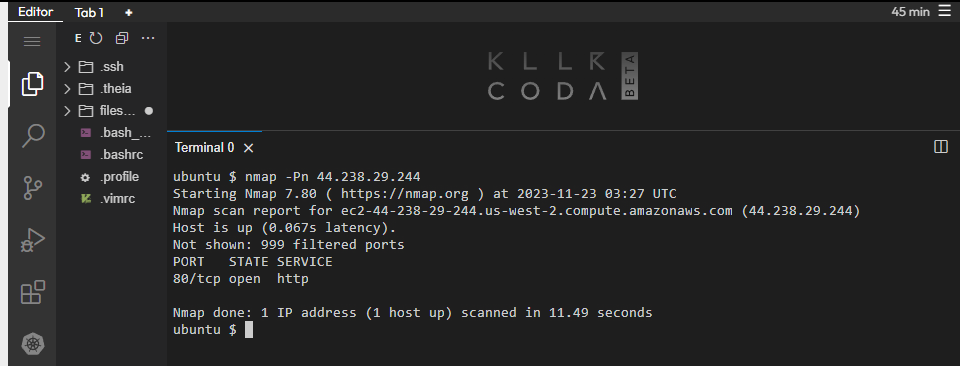

    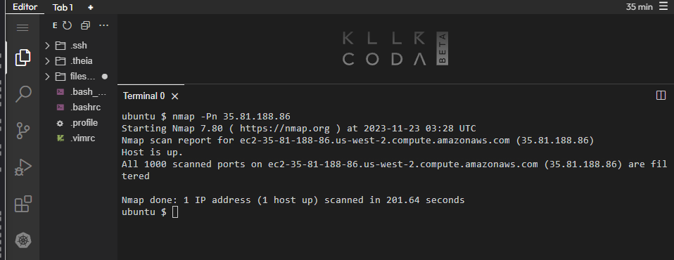

## Conclusión
- Se recomienda una evaluación más profunda de la configuración de seguridad, la implementación de medidas de protección adecuadas y la monitorización constante para mitigar riesgos potenciales. Estos hallazgos subrayan la importancia de mantener una postura proactiva en materia de ciberseguridad para prevenir posibles amenazas y fortalecer la seguridad del entorno digital asociado a 'vulnweb.com'.