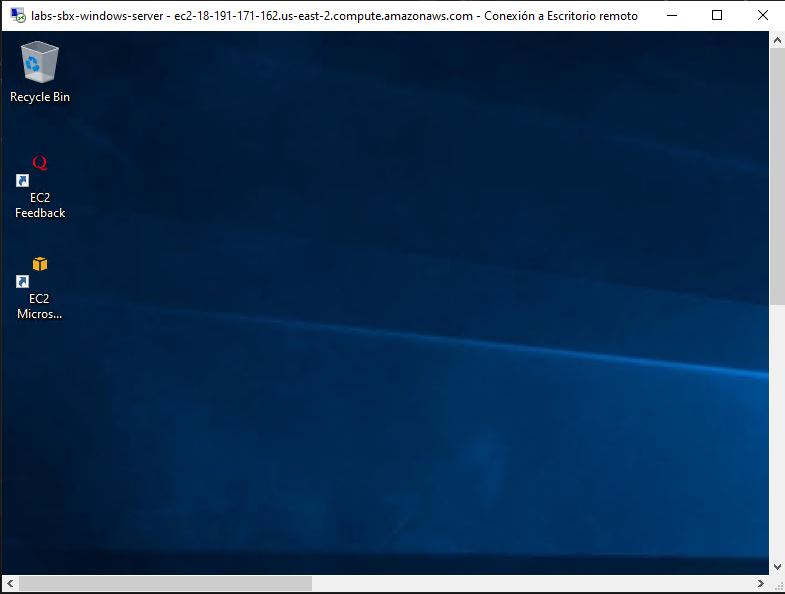

# Fas 2 - Desafio Modulo 6
Fecha de entrega: 09/08/2023

# Objetivo:

Buscamos como objetivo principal, acercarnos al uso de los servicios de esta Nube, detectar los servicios que necesitamos para cumplir con la consigna de la infraestructura como código que se nos pide. Puede que no estén definidas algunas configuraciones que deberemos realizar para que todo termine funcionando. En este caso, hay que investigarlas personalmente.

Requerimientos:

* Tener acceso a la consola de AWS con una menbresia Free.

## Consigna

* Se necesita crear una maquina virtual cuyo SO sea Windows. Que posea un Disco virtual de al menos 5 Gb y que pueda ser accedido via remota.

* Presentar el diseño en un repositorio de GitHub, con un README.md que contenga la documentación de los pasos realizados por la ejecución del provisionamiento.

* El codigo debe poseer todos los archivos de terraform y adjuntar el output del terraform plan.

## Comandos:

* Inicializar el directorio de trabajo de terraform:

````bash
terraform init
````

* Verificar que recursos se crearan con el siguiente comando:

````bash
terraform plan
````

* Si todo es correcto se crea la maquina virtual con el comando:

````bash
terraform apply
````

## Terraform plan output

```bash
Terraform used the selected providers to generate the following execution plan. Resource actions are indicated with the following symbols:
  + create

Terraform will perform the following actions:

  # aws_instance.windows-server will be created
  + resource "aws_instance" "windows-server" {
      + ami                                  = "ami-09e14f3154e091177"
      + arn                                  = (known after apply)    
      + associate_public_ip_address          = (known after apply)    
      + availability_zone                    = (known after apply)    
      + cpu_core_count                       = (known after apply)    
      + cpu_threads_per_core                 = (known after apply)    
      + disable_api_stop                     = (known after apply)    
      + disable_api_termination              = (known after apply)    
      + ebs_optimized                        = (known after apply)    
      + get_password_data                    = false
      + host_id                              = (known after apply)    
      + host_resource_group_arn              = (known after apply)    
      + iam_instance_profile                 = (known after apply)    
      + id                                   = (known after apply)    
      + instance_initiated_shutdown_behavior = (known after apply)    
      + instance_lifecycle                   = (known after apply)    
      + instance_state                       = (known after apply)    
      + instance_type                        = "t2.micro"
      + ipv6_address_count                   = (known after apply)    
      + ipv6_addresses                       = (known after apply)    
      + key_name                             = "aws-windows-server-kp"
      + monitoring                           = (known after apply)    
      + outpost_arn                          = (known after apply)    
      + password_data                        = (known after apply)    
      + placement_group                      = (known after apply)    
      + placement_partition_number           = (known after apply)    
      + primary_network_interface_id         = (known after apply)    
      + private_dns                          = (known after apply)
      + private_ip                           = (known after apply)
      + public_dns                           = (known after apply)
      + public_ip                            = (known after apply)
      + secondary_private_ips                = (known after apply)
      + security_groups                      = (known after apply)
      + source_dest_check                    = false
      + spot_instance_request_id             = (known after apply)
      + subnet_id                            = (known after apply)
      + tags                                 = {
          + "Environment" = "sbx"
          + "Name"        = "labs-sbx-windows-server"
        }
      + tags_all                             = {
          + "Environment" = "sbx"
          + "Name"        = "labs-sbx-windows-server"
        }
      + tenancy                              = (known after apply)
      + user_data                            = (known after apply)
      + user_data_base64                     = (known after apply)
      + user_data_replace_on_change          = false
      + vpc_security_group_ids               = (known after apply)

      + root_block_device {
          + delete_on_termination = true
          + device_name           = (known after apply)
          + encrypted             = true
          + iops                  = (known after apply)
          + kms_key_id            = (known after apply)
          + throughput            = (known after apply)
          + volume_id             = (known after apply)
          + volume_size           = 30
          + volume_type           = "gp2"
        }
    }

  # aws_security_group.aws-windows-server-sg will be created
  + resource "aws_security_group" "aws-windows-server-sg" {
      + arn                    = (known after apply)
      + description            = "Allow incoming connections"
      + egress                 = [
          + {
              + cidr_blocks      = [
                  + "0.0.0.0/0",
                ]
              + description      = ""
              + from_port        = 0
              + ipv6_cidr_blocks = []
              + prefix_list_ids  = []
              + protocol         = "-1"
              + security_groups  = []
              + self             = false
              + to_port          = 0
            },
        ]
      + id                     = (known after apply)
      + ingress                = [
          + {
              + cidr_blocks      = [
                  + "0.0.0.0/0",
                ]
              + description      = "Allow incoming HTTP connections"
              + from_port        = 80
              + ipv6_cidr_blocks = []
              + prefix_list_ids  = []
              + protocol         = "tcp"
              + security_groups  = []
              + self             = false
              + to_port          = 80
            },
          + {
              + cidr_blocks      = [
                  + "0.0.0.0/0",
                ]
              + description      = "Allow incoming RDP connections"
              + from_port        = 3389
              + ipv6_cidr_blocks = []
              + prefix_list_ids  = []
              + protocol         = "tcp"
              + security_groups  = []
              + self             = false
              + to_port          = 3389
            },
          + {
              + cidr_blocks      = [
                  + "0.0.0.0/0",
                ]
              + description      = "Allow incoming SSH connections"
              + from_port        = 22
              + ipv6_cidr_blocks = []
              + prefix_list_ids  = []
              + protocol         = "tcp"
              + security_groups  = []
              + self             = false
              + to_port          = 22
            },
        ]
      + name                   = "aws-windows-server-sg"
      + name_prefix            = (known after apply)
      + owner_id               = (known after apply)
      + revoke_rules_on_delete = false
      + tags                   = {
          + "Environment" = "sbx"
          + "Name"        = "labs-sbx-windows-server"
        }
      + tags_all               = {
          + "Environment" = "sbx"
          + "Name"        = "labs-sbx-windows-server"
        }
      + vpc_id                 = (known after apply)
    }

Plan: 2 to add, 0 to change, 0 to destroy.

Changes to Outputs:
  + vm_windows_server_instance_id         = (known after apply)
  + vm_windows_server_instance_public_dns = (known after apply)
  + vm_windows_server_instance_public_ip  = (known after apply)

Do you want to perform these actions?
  Terraform will perform the actions described above.
  Only 'yes' will be accepted to approve.

  Enter a value: yes

aws_security_group.aws-windows-server-sg: Creating...
aws_security_group.aws-windows-server-sg: Creation complete after 3s [id=sg-03b583c6cc5447903]
aws_instance.windows-server: Creating...
aws_instance.windows-server: Still creating... [10s elapsed]
aws_instance.windows-server: Still creating... [20s elapsed]
aws_instance.windows-server: Still creating... [30s elapsed]
aws_instance.windows-server: Still creating... [41s elapsed]
aws_instance.windows-server: Creation complete after 44s [id=i-0fcc607500a97157d]

Apply complete! Resources: 2 added, 0 changed, 0 destroyed.

Outputs:

vm_windows_server_instance_id = "i-0fcc607500a97157d"
vm_windows_server_instance_public_dns = "ec2-18-191-171-162.us-east-2.compute.amazonaws.com"
vm_windows_server_instance_public_ip = "18-191-171-162"
```

## Cliente RDP

1. Ejecutar el cliente RDP en la maquina local.
2. Ingresar la dirección IP publica de la maquina virtual.
3. Ingresar las credenciales de acceso para iniciar sesión.

