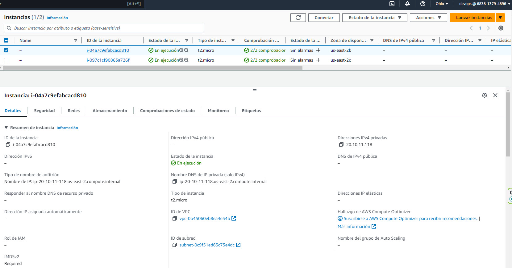

# Configuración de Ejemplo: AWS, Terraform y Balanceador de Carga

## Comandos:

* Inicializar el directorio de trabajo de terraform:

````bash
terraform init
````

* Verificar que recursos se crearan con el siguiente comando:

````bash
terraform plan
````

* Si todo es correcto se crea la maquina virtual con el comando:

````bash
terraform apply
````

## Terraform plan output

```bash
Terraform used the selected providers to generate the following execution plan. Resource actions are indicated with the following symbols:
  + create

Terraform will perform the following actions:

  # aws_alb_target_group_attachment.linux-application-load-balancer-target-group-http-attach[0] will be created
  + resource "aws_alb_target_group_attachment" "linux-application-load-balancer-target-group-http-attach" {
      + id               = (known after apply)
      + port             = 80
      + target_group_arn = (known after apply)
      + target_id        = (known after apply)
    }

  # aws_alb_target_group_attachment.linux-application-load-balancer-target-group-http-attach[1] will be created
  + resource "aws_alb_target_group_attachment" "linux-application-load-balancer-target-group-http-attach" {
      + id               = (known after apply)
      + port             = 80
      + target_group_arn = (known after apply)
      + target_id        = (known after apply)
    }

  # aws_eip.nat-gateway will be created
  + resource "aws_eip" "nat-gateway" {
      + allocation_id        = (known after apply)
      + association_id       = (known after apply)
      + carrier_ip           = (known after apply)
      + customer_owned_ip    = (known after apply)
      + domain               = (known after apply)
      + id                   = (known after apply)
      + instance             = (known after apply)
      + network_border_group = (known after apply)
      + network_interface    = (known after apply)
      + private_dns          = (known after apply)
      + private_ip           = (known after apply)
      + public_dns           = (known after apply)
      + public_ip            = (known after apply)
      + public_ipv4_pool     = (known after apply)
      + tags_all             = (known after apply)
      + vpc                  = true
    }

  # aws_instance.linux-server[0] will be created
  + resource "aws_instance" "linux-server" {
      + ami                                  = "ami-0cf0e376c672104d6"
      + arn                                  = (known after apply)
      + associate_public_ip_address          = false
      + availability_zone                    = (known after apply)
      + cpu_core_count                       = (known after apply)
      + cpu_threads_per_core                 = (known after apply)
      + disable_api_stop                     = (known after apply)
      + disable_api_termination              = (known after apply)
      + ebs_optimized                        = (known after apply)
      + get_password_data                    = false
      + host_id                              = (known after apply)
      + host_resource_group_arn              = (known after apply)
      + iam_instance_profile                 = (known after apply)
      + id                                   = (known after apply)
      + instance_initiated_shutdown_behavior = (known after apply)
      + instance_lifecycle                   = (known after apply)
      + instance_state                       = (known after apply)
      + instance_type                        = "t2.micro"
      + ipv6_address_count                   = (known after apply)
      + ipv6_addresses                       = (known after apply)
      + key_name                             = "key pair of srv_linux"
      + monitoring                           = (known after apply)
      + outpost_arn                          = (known after apply)
      + password_data                        = (known after apply)
      + placement_group                      = (known after apply)
      + placement_partition_number           = (known after apply)
      + primary_network_interface_id         = (known after apply)
      + private_dns                          = (known after apply)
      + private_ip                           = (known after apply)
      + public_dns                           = (known after apply)
      + public_ip                            = (known after apply)
      + secondary_private_ips                = (known after apply)
      + security_groups                      = (known after apply)
      + source_dest_check                    = false
      + spot_instance_request_id             = (known after apply)
      + subnet_id                            = (known after apply)
      + tags_all                             = (known after apply)
      + tenancy                              = (known after apply)
      + user_data                            = "f95de343c6f2c45e016afd9c7d6721c479165f8f"
      + user_data_base64                     = (known after apply)
      + user_data_replace_on_change          = false
      + vpc_security_group_ids               = (known after apply)

      + root_block_device {
          + delete_on_termination = true
          + device_name           = (known after apply)
          + encrypted             = true
          + iops                  = (known after apply)
          + kms_key_id            = (known after apply)
          + throughput            = (known after apply)
          + volume_id             = (known after apply)
          + volume_size           = 30
          + volume_type           = "gp2"
        }
    }

  # aws_instance.linux-server[1] will be created
  + resource "aws_instance" "linux-server" {
      + ami                                  = "ami-0cf0e376c672104d6"
      + arn                                  = (known after apply)
      + associate_public_ip_address          = false
      + availability_zone                    = (known after apply)
      + cpu_core_count                       = (known after apply)
      + cpu_threads_per_core                 = (known after apply)
      + disable_api_stop                     = (known after apply)
      + disable_api_termination              = (known after apply)
      + ebs_optimized                        = (known after apply)
      + get_password_data                    = false
      + host_id                              = (known after apply)
      + host_resource_group_arn              = (known after apply)
      + iam_instance_profile                 = (known after apply)
      + id                                   = (known after apply)
      + instance_initiated_shutdown_behavior = (known after apply)
      + instance_lifecycle                   = (known after apply)
      + instance_state                       = (known after apply)
      + instance_type                        = "t2.micro"
      + ipv6_address_count                   = (known after apply)
      + ipv6_addresses                       = (known after apply)
      + key_name                             = "key pair of srv_linux"
      + monitoring                           = (known after apply)
      + outpost_arn                          = (known after apply)
      + password_data                        = (known after apply)
      + placement_group                      = (known after apply)
      + placement_partition_number           = (known after apply)
      + primary_network_interface_id         = (known after apply)
      + private_dns                          = (known after apply)
      + private_ip                           = (known after apply)
      + public_dns                           = (known after apply)
      + public_ip                            = (known after apply)
      + secondary_private_ips                = (known after apply)
      + security_groups                      = (known after apply)
      + source_dest_check                    = false
      + spot_instance_request_id             = (known after apply)
      + subnet_id                            = (known after apply)
      + tags_all                             = (known after apply)
      + tenancy                              = (known after apply)
      + user_data                            = "f95de343c6f2c45e016afd9c7d6721c479165f8f"
      + user_data_base64                     = (known after apply)
      + user_data_replace_on_change          = false
      + vpc_security_group_ids               = (known after apply)

      + root_block_device {
          + delete_on_termination = true
          + device_name           = (known after apply)
          + encrypted             = true
          + iops                  = (known after apply)
          + kms_key_id            = (known after apply)
          + throughput            = (known after apply)
          + volume_id             = (known after apply)
          + volume_size           = 30
          + volume_type           = "gp2"
        }
    }

  # aws_internet_gateway.internet_gateway will be created
  + resource "aws_internet_gateway" "internet_gateway" {
      + arn      = (known after apply)
      + id       = (known after apply)
      + owner_id = (known after apply)
      + tags_all = (known after apply)
      + vpc_id   = (known after apply)
    }

  # aws_key_pair.key_pair_srv_linux will be created
  + resource "aws_key_pair" "key_pair_srv_linux" {
      + arn             = (known after apply)
      + fingerprint     = (known after apply)
      + id              = (known after apply)
      + key_name        = "key pair of srv_linux"
      + key_name_prefix = (known after apply)
      + key_pair_id     = (known after apply)
      + key_type        = (known after apply)
      + public_key      = (known after apply)
      + tags_all        = (known after apply)
    }

  # aws_lb.linux-application-load-balancer will be created
  + resource "aws_lb" "linux-application-load-balancer" {
      + arn                                         = (known after apply)
      + arn_suffix                                  = (known after apply)
      + desync_mitigation_mode                      = "defensive"
      + dns_name                                    = (known after apply)
      + drop_invalid_header_fields                  = false
      + enable_deletion_protection                  = false
      + enable_http2                                = false
      + enable_tls_version_and_cipher_suite_headers = false
      + enable_waf_fail_open                        = false
      + enable_xff_client_port                      = false
      + id                                          = (known after apply)
      + idle_timeout                                = 60
      + internal                                    = false
      + ip_address_type                             = (known after apply)
      + load_balancer_type                          = "application"
      + name                                        = "linux-application-load-balancer"
      + preserve_host_header                        = false
      + security_groups                             = (known after apply)
      + subnets                                     = (known after apply)
      + tags                                        = {
          + "Environment" = "yes"
          + "Name"        = "linux-application-load-balancer"
        }
      + tags_all                                    = {
          + "Environment" = "yes"
          + "Name"        = "linux-application-load-balancer"
        }
      + vpc_id                                      = (known after apply)
      + xff_header_processing_mode                  = "append"
      + zone_id                                     = (known after apply)
    }

  # aws_lb_listener.linux-application-load-balancer-listener-http will be created
  + resource "aws_lb_listener" "linux-application-load-balancer-listener-http" {
      + arn               = (known after apply)
      + id                = (known after apply)
      + load_balancer_arn = (known after apply)
      + port              = 80
      + protocol          = "HTTP"
      + ssl_policy        = (known after apply)
      + tags_all          = (known after apply)

      + default_action {
          + order            = (known after apply)
          + target_group_arn = (known after apply)
          + type             = "forward"
        }
    }

  # aws_lb_target_group.linux-application-load-balancer-target-group-http will be created
  + resource "aws_lb_target_group" "linux-application-load-balancer-target-group-http" {
      + arn                                = (known after apply)
      + arn_suffix                         = (known after apply)
      + connection_termination             = false
      + deregistration_delay               = "300"
      + id                                 = (known after apply)
      + ip_address_type                    = (known after apply)
      + lambda_multi_value_headers_enabled = false
      + load_balancing_algorithm_type      = "round_robin"
      + load_balancing_cross_zone_enabled  = (known after apply)
      + name                               = "load-balancer-target-group-http"
      + port                               = 80
      + preserve_client_ip                 = (known after apply)
      + protocol                           = "HTTP"
      + protocol_version                   = (known after apply)
      + proxy_protocol_v2                  = false
      + slow_start                         = 0
      + tags_all                           = (known after apply)
      + target_type                        = "instance"
      + vpc_id                             = (known after apply)

      + health_check {
          + enabled             = true
          + healthy_threshold   = 3
          + interval            = 30
          + matcher             = "200"
          + path                = "/"
          + port                = "80"
          + protocol            = "HTTP"
          + timeout             = 10
          + unhealthy_threshold = 3
        }

      + stickiness {
          + cookie_duration = 86400
          + enabled         = false
          + type            = "lb_cookie"
        }
    }

  # aws_nat_gateway.nat will be created
  + resource "aws_nat_gateway" "nat" {
      + allocation_id                      = (known after apply)
      + association_id                     = (known after apply)
      + connectivity_type                  = "public"
      + id                                 = (known after apply)
      + network_interface_id               = (known after apply)
      + private_ip                         = (known after apply)
      + public_ip                          = (known after apply)
      + secondary_private_ip_address_count = (known after apply)
      + secondary_private_ip_addresses     = (known after apply)
      + subnet_id                          = (known after apply)
      + tags_all                           = (known after apply)
    }

  # aws_route_table.private-route-table will be created
  + resource "aws_route_table" "private-route-table" {
      + arn              = (known after apply)
      + id               = (known after apply)
      + owner_id         = (known after apply)
      + propagating_vgws = (known after apply)
      + route            = [
          + {
              + carrier_gateway_id         = ""
              + cidr_block                 = "0.0.0.0/0"
              + core_network_arn           = ""
              + destination_prefix_list_id = ""
              + egress_only_gateway_id     = ""
              + gateway_id                 = (known after apply)
              + ipv6_cidr_block            = ""
              + local_gateway_id           = ""
              + nat_gateway_id             = ""
              + network_interface_id       = ""
              + transit_gateway_id         = ""
              + vpc_endpoint_id            = ""
              + vpc_peering_connection_id  = ""
            },
        ]
      + tags_all         = (known after apply)
      + vpc_id           = (known after apply)
    }

  # aws_route_table.public-route-table will be created
  + resource "aws_route_table" "public-route-table" {
      + arn              = (known after apply)
      + id               = (known after apply)
      + owner_id         = (known after apply)
      + propagating_vgws = (known after apply)
      + route            = [
          + {
              + carrier_gateway_id         = ""
              + cidr_block                 = "0.0.0.0/0"
              + core_network_arn           = ""
              + destination_prefix_list_id = ""
              + egress_only_gateway_id     = ""
              + gateway_id                 = (known after apply)
              + ipv6_cidr_block            = ""
              + local_gateway_id           = ""
              + nat_gateway_id             = ""
              + network_interface_id       = ""
              + transit_gateway_id         = ""
              + vpc_endpoint_id            = ""
              + vpc_peering_connection_id  = ""
            },
        ]
      + tags_all         = (known after apply)
      + vpc_id           = (known after apply)
    }

  # aws_route_table_association.private-route-table-network-1-association will be created
  + resource "aws_route_table_association" "private-route-table-network-1-association" {
      + id             = (known after apply)
      + route_table_id = (known after apply)
      + subnet_id      = (known after apply)
    }

  # aws_route_table_association.private-route-table-network-2-association will be created
  + resource "aws_route_table_association" "private-route-table-network-2-association" {
      + id             = (known after apply)
      + route_table_id = (known after apply)
      + subnet_id      = (known after apply)
    }

  # aws_route_table_association.public-route-table-network-1-association will be created
  + resource "aws_route_table_association" "public-route-table-network-1-association" {
      + id             = (known after apply)
      + route_table_id = (known after apply)
      + subnet_id      = (known after apply)
    }

  # aws_route_table_association.public-route-table-network-2-association will be created
  + resource "aws_route_table_association" "public-route-table-network-2-association" {
      + id             = (known after apply)
      + route_table_id = (known after apply)
      + subnet_id      = (known after apply)
    }

  # aws_security_group.aws-linux-security-group will be created
  + resource "aws_security_group" "aws-linux-security-group" {
      + arn                    = (known after apply)
      + description            = "Allow incoming HTTP connections"
      + egress                 = [
          + {
              + cidr_blocks      = [
                  + "0.0.0.0/0",
                ]
              + description      = ""
              + from_port        = 0
              + ipv6_cidr_blocks = []
              + prefix_list_ids  = []
              + protocol         = "-1"
              + security_groups  = []
              + self             = false
              + to_port          = 0
            },
        ]
      + id                     = (known after apply)
      + ingress                = [
          + {
              + cidr_blocks      = [
                  + "0.0.0.0/0",
                ]
              + description      = "Allow incoming HTTP connections"
              + from_port        = 80
              + ipv6_cidr_blocks = []
              + prefix_list_ids  = []
              + protocol         = "tcp"
              + security_groups  = []
              + self             = false
              + to_port          = 80
            },
          + {
              + cidr_blocks      = [
                  + "0.0.0.0/0",
                ]
              + description      = "Allow incoming SSH connections"
              + from_port        = 22
              + ipv6_cidr_blocks = []
              + prefix_list_ids  = []
              + protocol         = "tcp"
              + security_groups  = []
              + self             = false
              + to_port          = 22
            },
        ]
      + name                   = "linux security group"
      + name_prefix            = (known after apply)
      + owner_id               = (known after apply)
      + revoke_rules_on_delete = false
      + tags                   = {
          + "Environment" = "yes"
          + "Name"        = "aws-linux-security-group"
        }
      + tags_all               = {
          + "Environment" = "yes"
          + "Name"        = "aws-linux-security-group"
        }
      + vpc_id                 = (known after apply)
    }

  # aws_security_group.linux-application-load-balancer-security-group will be created
  + resource "aws_security_group" "linux-application-load-balancer-security-group" {
      + arn                    = (known after apply)
      + description            = "Allow web traffic to the load balancer"
      + egress                 = [
          + {
              + cidr_blocks      = [
                  + "0.0.0.0/0",
                ]
              + description      = ""
              + from_port        = 0
              + ipv6_cidr_blocks = []
              + prefix_list_ids  = []
              + protocol         = "-1"
              + security_groups  = []
              + self             = false
              + to_port          = 0
            },
        ]
      + id                     = (known after apply)
      + ingress                = [
          + {
              + cidr_blocks      = [
                  + "0.0.0.0/0",
                ]
              + description      = ""
              + from_port        = 80
              + ipv6_cidr_blocks = []
              + prefix_list_ids  = []
              + protocol         = "tcp"
              + security_groups  = []
              + self             = false
              + to_port          = 80
            },
        ]
      + name                   = "yes-yes-linux-application-load-balancer-security-group"
      + name_prefix            = (known after apply)
      + owner_id               = (known after apply)
      + revoke_rules_on_delete = false
      + tags                   = {
          + "Environment" = "yes"
          + "Name"        = "linux-application-load-balancer-security-group"
        }
      + tags_all               = {
          + "Environment" = "yes"
          + "Name"        = "linux-application-load-balancer-security-group"
        }
      + vpc_id                 = (known after apply)
    }

  # aws_subnet.private-network-1 will be created
  + resource "aws_subnet" "private-network-1" {
      + arn                                            = (known after apply)
      + assign_ipv6_address_on_creation                = false
      + availability_zone                              = "us-east-2c"
      + availability_zone_id                           = (known after apply)
      + cidr_block                                     = "20.10.10.0/24"
      + enable_dns64                                   = false
      + enable_resource_name_dns_a_record_on_launch    = false
      + enable_resource_name_dns_aaaa_record_on_launch = false
      + id                                             = (known after apply)
      + ipv6_cidr_block_association_id                 = (known after apply)
      + ipv6_native                                    = false
      + map_public_ip_on_launch                        = false
      + owner_id                                       = (known after apply)
      + private_dns_hostname_type_on_launch            = (known after apply)
      + tags_all                                       = (known after apply)
      + vpc_id                                         = (known after apply)
    }

  # aws_subnet.private-network-2 will be created
  + resource "aws_subnet" "private-network-2" {
      + arn                                            = (known after apply)
      + assign_ipv6_address_on_creation                = false
      + availability_zone                              = "us-east-2b"
      + availability_zone_id                           = (known after apply)
      + cidr_block                                     = "20.10.11.0/24"
      + enable_dns64                                   = false
      + enable_resource_name_dns_a_record_on_launch    = false
      + enable_resource_name_dns_aaaa_record_on_launch = false
      + id                                             = (known after apply)
      + ipv6_cidr_block_association_id                 = (known after apply)
      + ipv6_native                                    = false
      + map_public_ip_on_launch                        = false
      + owner_id                                       = (known after apply)
      + private_dns_hostname_type_on_launch            = (known after apply)
      + tags_all                                       = (known after apply)
      + vpc_id                                         = (known after apply)
    }

  # aws_subnet.public-network-1 will be created
  + resource "aws_subnet" "public-network-1" {
      + arn                                            = (known after apply)
      + assign_ipv6_address_on_creation                = false
      + availability_zone                              = "us-east-2c"
      + availability_zone_id                           = (known after apply)
      + cidr_block                                     = "20.10.12.0/24"
      + enable_dns64                                   = false
      + enable_resource_name_dns_a_record_on_launch    = false
      + enable_resource_name_dns_aaaa_record_on_launch = false
      + id                                             = (known after apply)
      + ipv6_cidr_block_association_id                 = (known after apply)
      + ipv6_native                                    = false
      + map_public_ip_on_launch                        = false
      + owner_id                                       = (known after apply)
      + private_dns_hostname_type_on_launch            = (known after apply)
      + tags_all                                       = (known after apply)
      + vpc_id                                         = (known after apply)
    }

  # aws_subnet.public-network-2 will be created
  + resource "aws_subnet" "public-network-2" {
      + arn                                            = (known after apply)
      + assign_ipv6_address_on_creation                = false
      + availability_zone                              = "us-east-2b"
      + availability_zone_id                           = (known after apply)
      + cidr_block                                     = "20.10.13.0/24"
      + enable_dns64                                   = false
      + enable_resource_name_dns_a_record_on_launch    = false
      + enable_resource_name_dns_aaaa_record_on_launch = false
      + id                                             = (known after apply)
      + ipv6_cidr_block_association_id                 = (known after apply)
      + ipv6_native                                    = false
      + map_public_ip_on_launch                        = false
      + owner_id                                       = (known after apply)
      + private_dns_hostname_type_on_launch            = (known after apply)
      + tags_all                                       = (known after apply)
      + vpc_id                                         = (known after apply)
    }

  # aws_vpc.vpc will be created
  + resource "aws_vpc" "vpc" {
      + arn                                  = (known after apply)
      + cidr_block                           = "20.10.0.0/16"
      + default_network_acl_id               = (known after apply)
      + default_route_table_id               = (known after apply)
      + default_security_group_id            = (known after apply)
      + dhcp_options_id                      = (known after apply)
      + enable_dns_hostnames                 = true
      + enable_dns_support                   = true
      + enable_network_address_usage_metrics = (known after apply)
      + id                                   = (known after apply)
      + instance_tenancy                     = "default"
      + ipv6_association_id                  = (known after apply)
      + ipv6_cidr_block                      = (known after apply)
      + ipv6_cidr_block_network_border_group = (known after apply)
      + main_route_table_id                  = (known after apply)
      + owner_id                             = (known after apply)
      + tags_all                             = (known after apply)
    }

  # local_file.ssh_key_srv_linux will be created
  + resource "local_file" "ssh_key_srv_linux" {
      + content              = (sensitive value)
      + content_base64sha256 = (known after apply)
      + content_base64sha512 = (known after apply)
      + content_md5          = (known after apply)
      + content_sha1         = (known after apply)
      + content_sha256       = (known after apply)
      + content_sha512       = (known after apply)
      + directory_permission = "0777"
      + file_permission      = "0777"
      + filename             = "key pair of srv_linux.pem"
      + id                   = (known after apply)
    }

  # tls_private_key.key_pair_srv_linux will be created
  + resource "tls_private_key" "key_pair_srv_linux" {
      + algorithm                     = "RSA"
      + ecdsa_curve                   = "P224"
      + id                            = (known after apply)
      + private_key_openssh           = (sensitive value)
      + private_key_pem               = (sensitive value)
      + private_key_pem_pkcs8         = (sensitive value)
      + public_key_fingerprint_md5    = (known after apply)
      + public_key_fingerprint_sha256 = (known after apply)
      + public_key_openssh            = (known after apply)
      + public_key_pem                = (known after apply)
      + rsa_bits                      = 4096
    }
```

## Evidencias:

* Instancias



* Volumenes


* Pares de Claves


* Balanceador de Carga


* Subredes


* Grupos de Seguridad


* Grupos de Destino

